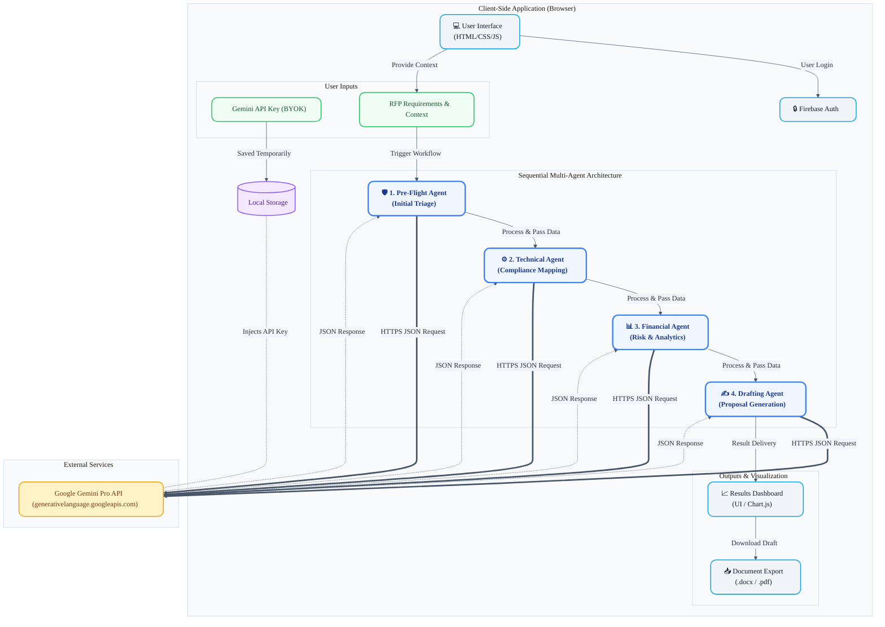

# Diamond Swagger AI - Architecture Diagram

Based on the specifications provided and the project's `README.md`, here is the high-level architectural diagram showing the data flow, components, and the generative AI integration.

## Architecture Summary

1. **Client-Side Centric Execution:** The architecture has zero backend storage or servers. Everything from UI manipulation to JSON parsing and routing happens within the application context in the user's browser.
2. **Bring Your Own Key (BYOK) Security:** To prevent centralized data breaches and mitigate billing attacks, users provide their own `Google Gemini API Key`. It gets securely saved in the native `Local Storage`.
3. **Sequential Multi-Agent Pipeline:** The core engine consists of four distinct AI agents acting in sequence (`Pre-Flight` -> `Technical` -> `Financial` -> `Drafting`). Each agent fulfills a unique domain constraint for maximum accuracy.
4. **Direct Generative AI Integration:** The client makes highly secure HTTPS REST calls directly bridging the browser and the Google Generative Language APIs without server-side proxy middle-men.
5. **Polished Visualization & Export:** The final structured data is passed back from the AI pipeline directly to the UI rendering chart analytics (`Chart.js`) and finalized exported documents (`docx.js`/`html2pdf.js`).
